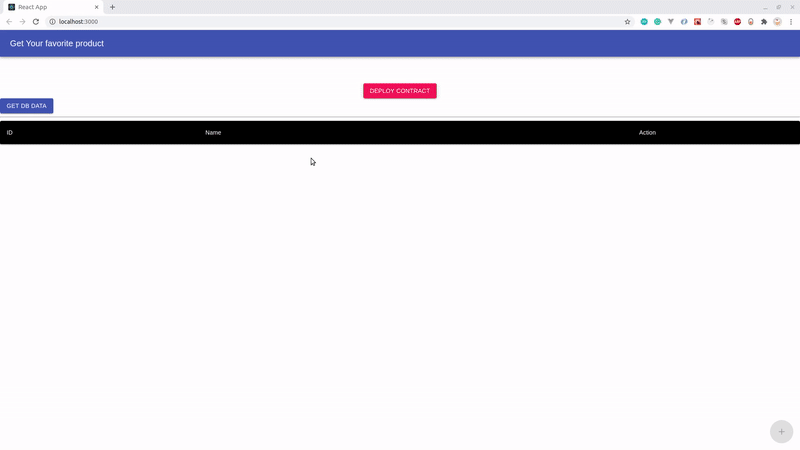

# Supply Chain Dapp

The supply chain Dapp is a simple version of getting more information about a product using Blockchain.A contract is required to add products in the blockchain, once a contract is deployed, users can add the products into the blockchain, as the blocks are read only, the end user/customer can trust as the historical data can be never altered in any way, shape or form. Yes, definitely you can add subsequent blocks to the blochain about any alterations to the products state in the real world.

This app is a tiny part of the huge idea of a fully functioning blockchain.

In this application:
1. An end user can _Deploy Contract_
2. Get results stored in the _Database_
3. View extra information for the entries in the _Database_
4. Add new products to the _Blockchain_ and _Database_
5. Get the new products list in the _Database_ and _Blockchain_

## Project architecture

The project is structure as microservice based architecture. (Not with Kafka/RabbitMQ) as the project is tiny. As the project gets expanded, a message queue can be added on.


```bash
├── supply-blockchain
│   ├── client
│   │   ├── React app
│   ├── dbserver
│   │   ├── Service to talk to DB
│   ├── server
│   │   ├── Service to talk to Blockchain
├── .gitignore
├── README.md
├── blockchain.sh
├── dbserver.sh
├── frontendscript.sh
└── script.sh
```

### Following libraries/resources are used to build the project

- Kaleido Developer Challenge Repo
- Node
- Sequelize ORM
- PostgreSQL
- React
- Material UI library

## How to run the project

- Use the link to setup Kaleido Blockchain [Click Here](https://github.com/kaleido-io/developer-challenge/blob/master/README.md#setting-up-your-kaleido-blockchain)
- Once all the configurations are added in the `server->config.js` file go ahead and run the `script.sh` script to spin up the complete project

### User interaction

- Once the react app runs go to `loocalhost:3000` in a browser (In case, if the script open this up automatically)
- Click on `DEPLOY CONTRACT` button.
- This will generate a contract and the SOLIDITY file would add in the 5 products similar in the database.
- Click on the `GET DB DATA` to get the values from DB. Seeders must have run before to generate 5 products.
- Click on the `VIEW` button to see more details of the product. Notice that this will make a GET request to the blockchain and you would be able to see more product information.
- Click on the `+` Floating action button to open the form to register a new product to the blockchain.
- Fill the form and click on the `Register a new product` button.
- This will make a POST to the `Blockchain server` that in turn will update the database as well.
- Now click on the `GET DB DATA` button to get the updated list of products in database.
- Click on the `VIEW` button in the newly added product, this will make a GET to the Blockchain and you'll see more information that you had previously added in the form.
- Thats it 🙂

## Demo:



## Known issues
- Database is not cleared when a new contract is deployed, and causes blockchain to return `No data`.
- Refreshing the Front end page will cause the Contract value to lose and a new contract will have to created. (Database will still contain the old added products and the count/id will be out of synce causing the app to fail to add products)
- Need to refresh table by clicking `GET DB DATA` button


## The following tasks are completed.

- [x] Have a Web based user experience, built in React
- [x] Have a backend-for-the-frontend (BFF), written in Node.js
- [x] Have on-chain Smart Contract logic, written in Solidity
- [x] Use a Kaleido blockchain
- [x] Contain a README that gives a quick overview of the use case, and tells us how to run it